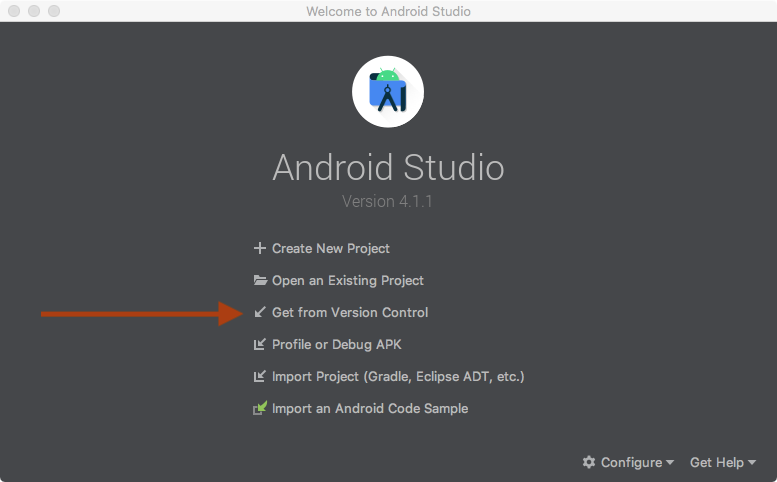
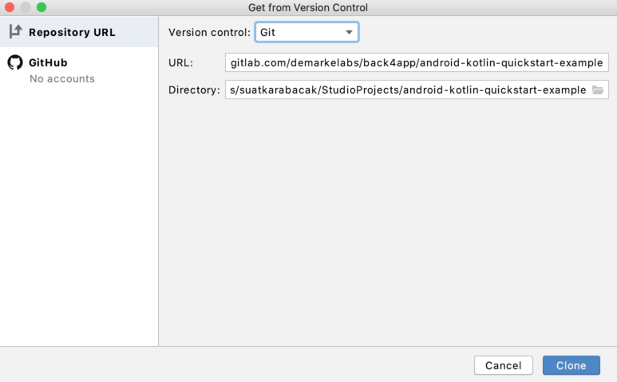
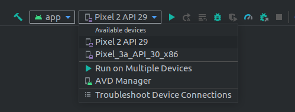

# Todo App
> Um aplicativo Android de organização de tarefas

[![NPM Version][npm-image]][npm-url]
[![Build Status][travis-image]][travis-url]
[![Downloads Stats][npm-downloads]][npm-url]

> O aplicativo Todo tem como objetivo tornar a vida do usuário mais organizada proporcionando a ele um aplicativo de fácil visualização 
> mas ao mesmo tempo com várias features que permitem ao usuário definir tarefas de forma simples e intuitiva. 
> Além disso possui um design moderno  para tornar o uso do app mais confortável para o usuário.


## Instalação

Android:

> A instalação se passa em um ambiente Desktop

1. Instale o programa Android Studio;
2. Crie um projeto a partir do repositório;








3. Conecte o seu dispositivo Android a seu Desktop;
3.1 Permita a conexão entre os dispositivos no seu Android;
4. Selecione o seu dispositivo para o aplicativo executar;



5. Clique em executar e espere o AndroidStudio relatar sucesso na execução;
6. Pronto, o aplicativo está instalado.

## Exemplo de uso

Alguns exemplos interessantes e úteis sobre como seu projeto pode ser utilizado. Adicione blocos de códigos e, se necessário, screenshots.

_Para mais exemplos, consulte a [Wiki][wiki]._ 

## Configuração para Desenvolvimento

Descreva como instalar todas as dependências para desenvolvimento e como rodar um test-suite automatizado de algum tipo. Se necessário, faça isso para múltiplas plataformas.

```sh
make install
npm test
```

## Histórico de lançamentos

* 0.2.1
    * MUDANÇA: Atualização de docs (código do módulo permanece inalterado)
* 0.2.0
    * MUDANÇA: Remove `setDefaultXYZ()`
    * ADD: Adiciona `init()`
* 0.1.1
    * CONSERTADO: Crash quando chama `baz()` (Obrigado @NomeDoContribuidorGeneroso!)
* 0.1.0
    * O primeiro lançamento adequado
    * MUDANÇA: Renomeia `foo()` para `bar()`
* 0.0.1
    * Trabalho em andamento

## Meta

Seu Nome – [@SeuNome](https://twitter.com/...) – SeuEmail@exemplo.com

Distribuído sob a licença XYZ. Veja `LICENSE` para mais informações.

[https://github.com/yourname/github-link](https://github.com/othonalberto/)

## Contributing

1. Faça o _fork_ do projeto (<https://github.com/yourname/yourproject/fork>)
2. Crie uma _branch_ para sua modificação (`git checkout -b feature/fooBar`)
3. Faça o _commit_ (`git commit -am 'Add some fooBar'`)
4. _Push_ (`git push origin feature/fooBar`)
5. Crie um novo _Pull Request_

[npm-image]: https://img.shields.io/npm/v/datadog-metrics.svg?style=flat-square
[npm-url]: https://npmjs.org/package/datadog-metrics
[npm-downloads]: https://img.shields.io/npm/dm/datadog-metrics.svg?style=flat-square
[travis-image]: https://img.shields.io/travis/dbader/node-datadog-metrics/master.svg?style=flat-square
[travis-url]: https://travis-ci.org/dbader/node-datadog-metrics
[wiki]: https://github.com/seunome/seuprojeto/wiki
